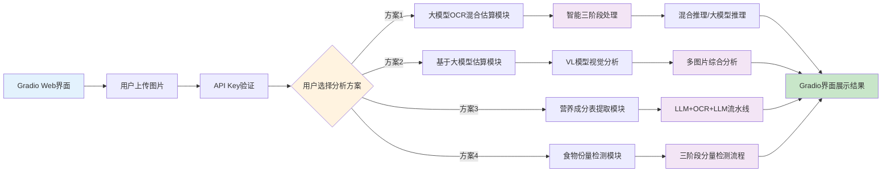

# 基于Ernie4.5和PaddleOCR的食物热量计算器

【AI Studio Warning】本项目代码即文档由AI生成，请谨慎评估代码片段的正确性和安全性。本文成文时间为 2025年8月12日。

- 本项目采用Vibe Coding
- 模型采用Claude
- 人工在项目中的贡献为架构设计、硬件移植、调试、微调
- 由于本项目的开发依赖于AI，因此不对代码实现进行详细解读，主要描述项目架构与设计理念。（基于类似的架构理念，你可以通过Vibe Coding 对项目进行调节，或着快速找到响应的模块做二次开发）

## 项目概述

本项目是一个基于视觉大模型和OCR的食物热量计算器，通过图像识别和自然语言处理技术，帮助用户快速准确地分析食物的热量和营养成分。系统支持处理包装食品的营养标签、新鲜食材以及自制食品等多种场景，为用户提供便捷的饮食热量管理工具。你可以上传一个食物的多角度照片、包装袋的正反面照片，通过大模型+PaddleOCR给出热量评估。

> 本项目的Gradio实现支持上传多张图片，但这些图片应当均属于同一个食物。

### 系统工作流程


## 架构设计

本项目采用基于Gradio的Web应用架构，提供直观的前端界面服务。Gradio负责用户交互、文件上传、结果展示等前端功能，计算后，结果将通过Gradio界面返回给用户。



### 模块说明

#### 大模型OCR混合估算模块 (LLM+OCR混合方案)
- **适用场景**：有营养标签的包装食品热量计算
- **执行逻辑**：采用智能三阶段处理流程，精确计算食物热量
  1. **营养表检测阶段**：使用VL模型检测图片中是否包含营养成分表
  2. **分量信息检测阶段**：对包含营养表的图片进一步检测是否包含分量信息
  3. **智能推理阶段**：根据检测结果选择推理模式
     - **混合推理**：同时检测到营养表和分量信息时，使用OCR提取文字 → LLM分析营养成分和分量 → 精确计算热量
     - **大模型推理**：仅检测到营养表或无分量信息时，直接使用VL模型估算热量
  4. **结果综合阶段**：多张图片时进行综合热量计算


#### 基于大模型估算模块 (纯LLM方案)
- **适用场景**：所有类型食物（新鲜食材、自制食品、包装食品等）
- **执行逻辑**：
  1. 直接将食物图片输入Ernie4.5-VL视觉大模型进行分析
  2. 模型通过视觉识别分析食物类型、重量和份量
  3. 单张图片直接输出热量估算，多张图片进行综合分析
  4. 基于模型训练数据和视觉特征估算热量和营养成分


#### 营养成分表提取模块 (LLM+OCR+LLM方案)
- **适用场景**：需要详细营养成分信息的包装食品
- **执行逻辑**：
  1. **营养表检测**：VL模型判断图片中是否存在营养成分表
  2. **OCR文字提取**：对检测到营养表的图片使用PaddleOCR提取所有文字信息
  3. **结构化解析**：LLM对提取的文字进行结构化解析，输出完整的营养成分数据
  4. **格式化输出**：将营养成分以结构化格式呈现给用户


#### 食物份量检测模块 (LLM+OCR+LLM方案)
- **适用场景**：需要准确份量信息的包装食品或标签
- **执行逻辑**：
  1. **分量信息检测**：VL模型检测图片中是否包含份量信息（重量、体积、净含量等）
  2. **OCR文字提取**：对检测到分量信息的图片使用PaddleOCR提取相关文字
  3. **分量分析**：LLM分析并标准化份量数据，统一单位格式
  4. **结果输出**：输出食物名称、份量数值、单位、原始标注等详细信息


## 项目结构

```
DietEstimator/
├── main.py                    # 项目主入口，启动Gradio应用
├── README.md                  # 项目说明文档
├── requirements.txt           # Python依赖包列表
└── Tools/                     # 核心功能模块目录
    ├── __init__.py           # 包初始化文件
    ├── gradio_ui.py          # Gradio用户界面模块
    ├── gradio_backend.py     # Gradio后端业务逻辑处理
    ├── model_api.py          # AI模型API调用封装
    ├── ocr_utils.py          # PaddleOCR文字识别工具
    └── prompt_helper.py      # AI提示词模板和辅助函数
```

### 代码架构说明

#### 分层设计
- **展示层** (`gradio_ui.py`)：负责用户界面设计和交互逻辑
- **业务层** (`gradio_backend.py`)：处理具体的业务流程和数据处理
- **服务层** (`model_api.py`, `ocr_utils.py`)：提供AI模型调用和OCR识别服务
- **工具层** (`prompt_helper.py`)：提供提示词模板和辅助功能

#### 核心模块功能
- **gradio_ui.py**：构建Web界面，处理用户交互事件
- **gradio_backend.py**：实现四种分析方案的业务逻辑
- **model_api.py**：封装百度文心一言API调用，支持文本和视觉模型
- **ocr_utils.py**：集成PaddleOCR，提供图片文字识别功能
- **prompt_helper.py**：管理AI提示词模板，确保模型输出格式标准化

## 快速开始

### 环境要求
- Python 3.8+
- Windows/Linux/MacOS

### 安装依赖
```bash
pip install -r requirements.txt
```

### 运行应用

1. 启动应用：
```bash
python main.py
```

2. 应用启动后，会在控制台显示访问地址，通常为：
```
Running on local URL:  http://0.0.0.0:7860
```

3. 在浏览器中打开该地址即可使用
```
http://127.0.0.1:7860/
```

### 使用说明

#### 准备工作
1. **获取API Key**：需要申请百度文心一言API密钥
2. **准备图片**：拍摄清晰的食物图片（支持多张图片分析同一食物）

#### 操作步骤
1. **上传图片**：点击"上传食物图片"按钮，选择一张或多张同一食物的图片
2. **输入API Key**：在API Key输入框中填入您的百度文心一言API密钥
3. **选择分析方案**：
   - 有营养标签的包装食品 → 选择"大模型OCR混合估算"
   - 新鲜食材或自制食品 → 选择"大模型估算热量"
   - 需要完整营养信息 → 选择"营养成分表提取"
   - 仅需份量信息 → 选择"食物份量检测"
4. **开始分析**：点击对应的分析按钮，等待分析结果

#### 使用技巧
- **多角度拍摄**：对于包装食品，建议拍摄包装的正反面以获得更准确的结果
- **图片清晰度**：确保营养标签或食物内容清晰可见
- **光线充足**：在光线良好的环境下拍摄，提高OCR识别准确率

### 注意事项
- 首次运行时PaddleOCR会自动下载模型文件，请确保网络连接正常
- API Key请妥善保管，避免泄露
- 分析结果仅供参考，实际营养成分可能因食材来源、制作方法等因素有所差异
